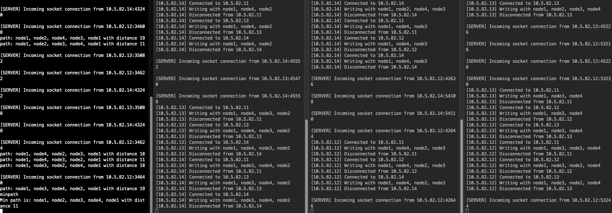
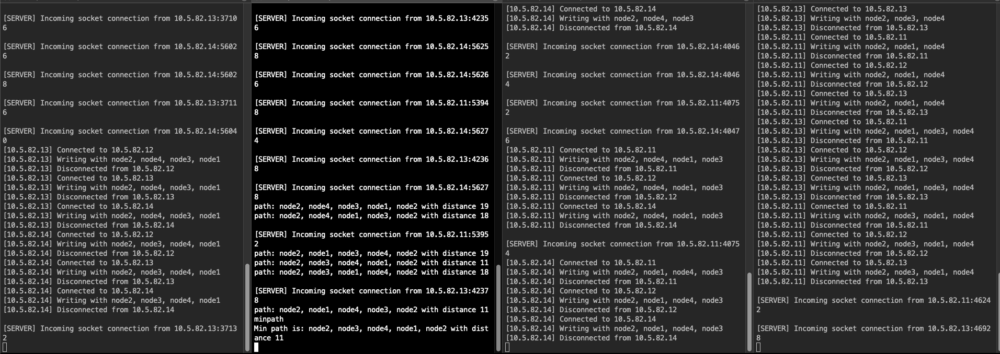
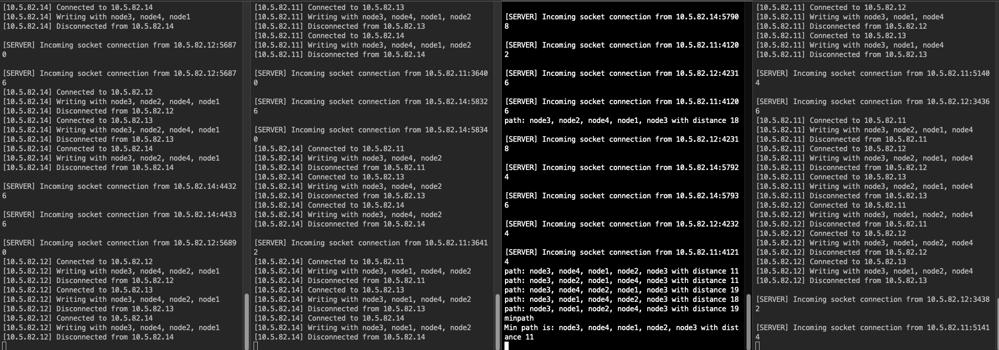
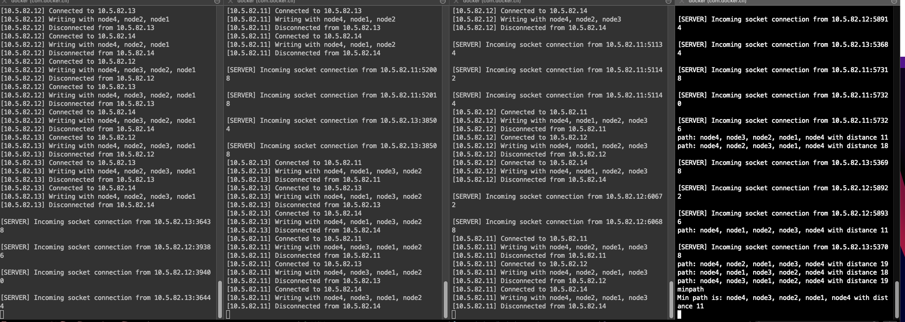

# tsp-network

This repository is for the tsp-network project. This project uses Docker to create a network and utilizes multiple terminals to simulate different nodes in the network.

# People
- 64090500404 Thanyapisit Buaoprakhong
- 64090500407 Varinthorn Sittisin

## Prerequisites

- [Docker](https://www.docker.com/)
- [Node.js](https://nodejs.org/)

## Setup

1. Create a Docker network:

   ```bash
   docker network create --driver=bridge --subnet=10.5.0.0/16 bridge0
   ```

2. Bring up the Docker services:

   ```bash
   docker compose up -d
   ```

3. Open four terminals. In each terminal, execute the following command, replacing `n1` with `n2`, `n3`, and `n4` respectively in each terminal:

   ```bash
   docker exec -it tenten-bfs-n1 /bin/bash
   ```

4. In each terminal, navigate to the `test1` directory:

   ```bash
   cd mnt/source/test1
   ```

5. In each terminal, run one of the following commands:

   - Terminal 1:

     ```bash
     node index.js node1 "10.5.82.12,10.5.82.13,10.5.82.14|5,6,2"
     ```

   - Terminal 2:

     ```bash
     node index.js node2 "10.5.82.11,10.5.82.13,10.5.82.14|5,3,7"
     ```

   - Terminal 3:

     ```bash
     node index.js node3 "10.5.82.11,10.5.82.12,10.5.82.14|6,3,1"
     ```

   - Terminal 4:

     ```bash
     node index.js node4 "10.5.82.11,10.5.82.12,10.5.82.13|2,7,1"
     ```
## Output
- Terminal 1
  
- Terminal 2
  
 - Terminal 3
  
 - Terminal 4
  
 

## License

This project is licensed under the terms of the [MIT license](https://github.com/tententgc/tsp-network/blob/main/LICENSE).

---

Please note that you may need to add or adjust some information according to the actual usage and requirements of the project. For example, you may want to add an introduction, contribution guidelines, and support details to the README.
